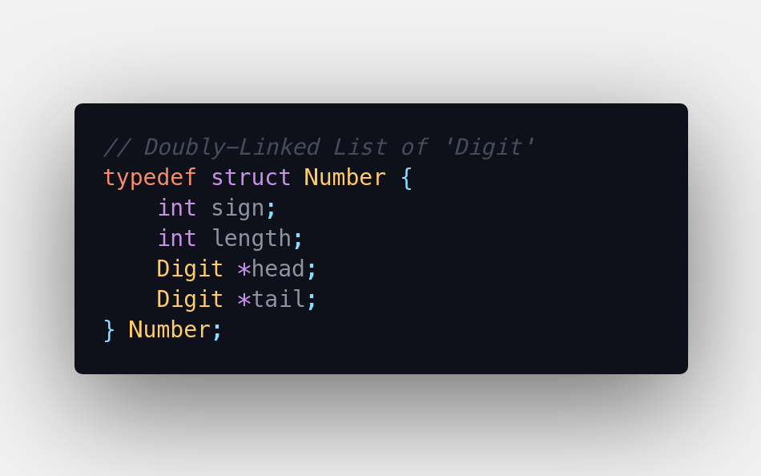

# BC

## DSA-I mini project

BC is an arbitrary precision calculator written in C, inspired by the GNU bc.  
Note: Currently, it is using a workaround for parsing. You can perform only one operation at a time.

## Prerequisites

- GCC-11
- CMake (>=3.19)

## Usage

For building the project for the first time.

```
mkdir <directory_name>
cd <directory_name>
cmake ..
```

Then for further builds, use `make` in the directory created in the previous step. Refer [this](media/install_build.gif) demo, if required.

## Operations supported

|     |                |      |                |
| --- | -------------- | ---- | -------------- |
| `+` | Addition       | `%`  | Modulo         |
| `-` | Subtraction    | `**` | Exponentiation |
| `*` | Multiplication | `<<` | Shift Left     |
| `/` | Division       | `>>` | Shift Right    |

## Data structures

<details>

| Digit                     | Number                      |
| ------------------------- | --------------------------- |
|  |  |

| node_N                      | stack_N                       |
| --------------------------- | ----------------------------- |
|  |  |

| node_C                      | stack_C                       |
| --------------------------- | ----------------------------- |
|  |  |

| Pair                    | token                     |
| ----------------------- | ------------------------- |
|  |  |

</details>

## Future plans/updates

- Convert given infix expression to postfix notation to ease the task of parsing and evaluating.
- Optimising multiplication by implementing it using [Karatsuba algorithm](https://en.wikipedia.org/wiki/Karatsuba_algorithm).
- Rewrite the whole project in C++, to add some additional features which can take the help of the OOP concepts.
- Use 'binary tree' data structure for expression evaluation.

## Mentor

Asst. Prof. Shrida Kalamkar

## References

- https://www.gnu.org/software/bc/
- https://github.com/ShripadMhetre/Bash_Calculator/
